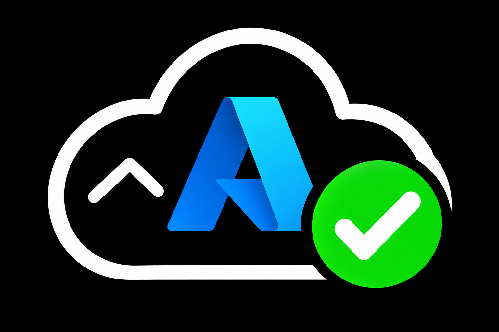

# Azure Extensible Systray Monitor



Current version: **0.7.2 public preview** — see the [changelog](CHANGELOG.md).

> **Prototype:** Windows 11 only. **Azure Health Beacon** lets you discover Azure signal surfaces and turn the properties, Resource Graph records, logs, Application Insights telemetry, and metrics you care about into tray warnings.

Azure Health Beacon is a small system-tray monitor that answers one question at a glance: **is anything in Azure broken that I need to care about right now?**

It checks configured resources every five minutes, displays a persistent visual state, and opens a concise incident view when clicked.

## Lifecycle first

The application is designed around the complete operating lifecycle, not only the steady-state monitor:

| Phase | Required behavior |
|---|---|
| First-ever use | Start grey, open setup automatically, and block monitoring |
| Add Azure connection | Open Microsoft's interactive OAuth login and create an app-owned DPAPI-encrypted cache |
| Test connection | Select a subscription and complete a live, read-only Azure request |
| Add rule | Choose a guided native check, resource property, Resource Graph, Logs/Application Insights, or metric source |
| Test rule | Run the exact unsaved rule live and show its result without saving |
| Apply rule | Enabled only after the current rule contents have produced a reachable result |
| Rules exist | Check every five minutes; aggregate results into one tray state |
| Connection reaches 14 days | Stop monitoring, hard-delete the app-owned encrypted identity cache, and require setup again |
| Export rules | Produce a credential-free, data-only team rule pack |
| Import rules | Strictly validate and import disabled pending review and testing |
| Delete rule | Confirm and remove only the selected rule |
| Delete Azure connection | Delete the encrypted identity cache and scope binding; retain rules |
| Update the app | Manual by default; notification or automatic installation requires explicit opt-in |
| Remove the app | Use Windows Installed apps; local rules and credentials are retained unless explicitly deleted |

See [Lifecycle](docs/lifecycle.md) and [First-run setup](docs/first-run.md).

## Credential security

Azure Health Beacon has no username, password, passkey, MFA, client-secret, certificate, or connection-string field. Microsoft's browser handles passkeys, security keys, Authenticator, Windows Hello, passwords, Conditional Access, and other tenant-approved methods. The Beacon consumes only the resulting OAuth authorization. The reusable session is stored only as Windows DPAPI CurrentUser ciphertext under `%LOCALAPPDATA%\AzureHealthBeacon\identity`; plaintext fallback is forbidden.

The app does not execute Azure CLI, require it to be installed, or read the user's normal `%USERPROFILE%\.azure` profile. Monitoring uses direct HTTPS calls to Azure Resource Manager, Resource Graph, Log Analytics/Application Insights, and Azure Monitor.

The authorization lease is exactly 14 days and is not configurable. At expiry, monitoring stops and the complete app-owned encrypted identity directory is deleted. Rules remain, and the user must sign in again.

Read [Credential security](docs/credential-security.md) and [Security policy](SECURITY.md) before using the prototype with a work account. Microsoft Authentication Extensions documents that its Windows persistence uses DPAPI: [MSAL Extensions](https://github.com/AzureAD/microsoft-authentication-extensions-for-python).

## Install

Download the installer from the [latest GitHub release](https://github.com/Anders0lesen/azure-extensible-systray-monitor/releases/latest) and run `AzureHealthBeacon-Setup-v0.7.2.exe`. It installs for the current Windows user, adds a Start Menu entry, and does not request administrator access.

The public-preview installer is not Authenticode code-signed yet, so Windows may show **Unknown publisher**. The release includes a SHA-256 checksum and GitHub build-provenance attestation. Do not install a copy obtained from anywhere except this repository.

## First use

1. Start `AzureHealthBeacon.exe`.
2. Select **Sign in with Microsoft** in the automatically opened setup wizard.
3. Complete whichever passkey, security-key, Authenticator, Windows Hello, password, Conditional Access, or MFA prompts Microsoft presents.
4. Select the intended subscription.
5. Select **Test credentials and finish setup**.
6. Continue to checks only after validation succeeds.
7. Select **Add a check**, then explicitly choose one of the six signal-source cards; nothing is preselected.
8. Use the source-specific Azure discovery picker, define what counts as a finding, select **Test without saving**, then **Save and enable**.

Until setup succeeds, the tray remains grey and monitoring/check-management commands are disabled. Overview, Settings, About, update recovery, and the sanitized diagnostic log remain available.

## Tray states

| State | Icon | Meaning |
|---|---|---|
| Healthy | Solid green ball | Every enabled rule returned its expected value |
| Unconnectable | Grey crosshatched circle | Setup is incomplete, authorization expired, authentication failed, or Azure is unreachable |
| Connecting | Spinning circular arrow | Establishing or restoring the Azure connection |
| Failed | Solid red ball | Azure returned a value that violates a configured rule |
| Checking | Pulsing amber ball | A scheduled/manual check is running unless a confirmed red condition already exists |

Red is reserved for a confirmed Azure problem. Authentication and network failures are grey.

The application artwork is used for Windows branding only. The tray deliberately continues to use the five operational state icons above; it is a monitoring surface, not a branding surface.

## Signal sources and rules

Version `0.7.2` supports six strict, data-only signal sources:

- **Provisioning state:** confirm that one resource's `properties.provisioningState` matches the configured healthy states.
- **VM power state:** read one virtual machine's live instance view and choose which `PowerState/...` values are healthy.
- **Resource property (advanced):** choose a constrained ARM property path, comparison, and healthy value without writing code.
- **Resource Graph/KQL findings:** run one read-only query across every enabled subscription the login can access. Zero rows is healthy; one or more rows is a confirmed red finding.
- **Logs/Application Insights KQL:** select a discoverable Log Analytics workspace, browse its tables, and run full Azure Monitor KQL. Zero rows is healthy; returned rows are findings.
- **Azure Monitor metric:** select any readable resource and one of its live metric definitions, then configure aggregation, lookback, reducer, optional dimension filter, comparison, and threshold.

The redesigned Windows shell is dark by default and has a light-mode toggle in the top right. Rule names, sources, queries, thresholds, and enabled state are editable. Source-specific discovery reads the workspaces, resources, metric names, units, aggregations, and dimensions available to the signed-in identity. The KQL editor remains transparent and user-controlled rather than hiding monitoring logic behind fixed check types.

You can edit or write your own [Resource Graph query](https://learn.microsoft.com/azure/governance/resource-graph/concepts/query-language) or [Azure Monitor log query](https://learn.microsoft.com/azure/azure-monitor/logs/queries), then test the exact unsaved text. Azure Monitor Logs requires query/read permission on the selected workspace. Metric availability depends on the selected resource's definitions.

Authentication, authorization, connectivity, timeout, invalid-query, and incomplete-scope errors are grey. If one tenant produces a confirmed finding while another tenant cannot be checked, red wins and the result says the scope was partial.

Native property rules read directly from Azure Resource Manager and retain only the explicitly selected property. The full resource document is not stored, logged, or exported.

## Rule packs

Exports contain source metadata, thresholds, resource/workspace identifiers, and KQL text but no authentication material or query results. Imports reject unknown fields, scripts, commands, non-Azure links, excessive size/count, duplicate IDs, credential-like fields, and common secret formats. Imported rules are disabled until reviewed, tested, and applied.

Resource names, subscription IDs, and tenant IDs can still be sensitive internal metadata. Use an approved team channel.

## Updates

Open **Settings** from the status window or tray menu.

| Mode | Network behavior | Installation behavior |
|---|---|---|
| Manual only | No background update requests | You select **Check for updates**, approve once, and the in-place update closes and restarts the app |
| Notify me | Checks GitHub once per day | Notification only; you approve installation |
| Install automatically | Checks GitHub once per day | Downloads, verifies, installs silently, and restarts the Beacon |

Manual is the default for new and upgraded configurations. Enabling automatic installation requires a separate confirmation and can be disabled at any time.

Updates are pinned to this exact repository and exact asset name. The app requires GitHub's release-asset SHA-256 digest and the separately published checksum to match the downloaded installer before it runs. Update requests contain the app version and standard HTTP metadata only; Azure credentials, tenant/subscription bindings, and rules are not sent.

## Development build

Requirements:

- Windows 11
- Python 3.12
- .NET SDK 10

```powershell
./build.ps1
```

The script creates `.venv`, installs pinned dependencies, runs tests, and builds the self-contained Windows shell at `dist/AzureHealthBeacon.exe` plus its private engine at `dist/AzureHealthBeaconCore.exe`. The engine is launched hidden by the shell and does not listen on a network port.

With Inno Setup 7 installed, build the per-user installer as well:

```powershell
./build.ps1 -Installer
```

## Windows startup

Both **Start with Windows** and **Start minimized in the notification area** are explicitly opt-in under **Settings**. Uninstalling the app removes its startup entry.

## Prototype limitations

- The executable and installer are not Authenticode code-signed yet; GitHub provenance and checksums are provided, but Windows publisher verification requires a future signing certificate.
- First-use validation lists only the number of resource groups and therefore requires that Azure permission.
- Resource Graph is eventually consistent and cannot prove live packet flow.
- Generic log rules cannot infer whether silence means healthy or missing telemetry. Query/table/access failures are grey; where silence itself matters, write an explicit heartbeat or freshness rule.
- The discovery catalogue is permission-scoped and capped at 1,000 ARM resources per refresh; it does not claim to enumerate data the signed-in identity cannot read.
- The application can delete everything it owns, but it cannot securely erase an account retained by Windows WAM without modifying system-wide account state.
- A compromised Windows user session can act with that user's permissions; no desktop app can make that scenario impossible.

See [Architecture](docs/architecture.md) for extension boundaries and roadmap, and the [UI redesign plan](docs/ui-redesign-plan.md) for the modern Windows shell and no-preselection check workflow.
